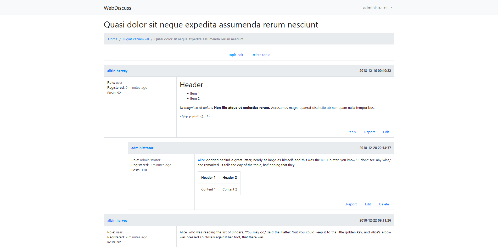

# WebDiscuss
WebDiscuss to prosty system forum internetowego stworzony w oparciu o framework [Laravel 5.7](https://laravel.com).

### Strona główna
[](https://raw.githubusercontent.com/plyschik/pbaw-web-discuss/master/docs/images/screenshot1.png)

### Widok tematu
[](https://raw.githubusercontent.com/plyschik/pbaw-web-discuss/master/docs/images/screenshot2.png)

### Profil użytkownika
[](https://raw.githubusercontent.com/plyschik/pbaw-web-discuss/master/docs/images/screenshot3.png)

### Statystyki forum
[](https://raw.githubusercontent.com/plyschik/pbaw-web-discuss/master/docs/images/screenshot4.png)

### Panel zarządzania banami
[](https://raw.githubusercontent.com/plyschik/pbaw-web-discuss/master/docs/images/screenshot5.png)

# Funkcjonalność
* Rejestracja nowych użytkowników wraz potwierdzeniem adresu email,
* Uwierzytelnianie użytkowników,
* System ról użytkowników (zwykły użytkownik, moderator oraz administrator), który ogranicza dostęp do określonych funkcji systemu,
* Banowanie użytkowników za łamanie zasad (wraz z panelem do przeglądania zgłoszeń),
* Kategorie oraz podkategorie, które pozwalają na tematyczną segregację tematów,
* Tematy wraz z odpowiedziami (+ możliwość odpowiadania na odpowiedzi),
* Zgłaszanie tematów oraz odpowiedzi za łamanie zasad,
* Profile użytkowników, które zawierają szczegółowe dane i statystyki na temat aktywności użytkownika prezentowane w formie wykresów,
* Szczegółowe statystyki całego systemu, które dotyczą aktywności wszystkich użytkowników prezentowane w formie wykresów.

[Szczegółowy opis funkcjonalności](docs/features.md)

## WymaganiaW
* PHP 7.1.3 lub wyższej,
* MySQL,
* spełnienie [wymagań](https://laravel.com/docs/5.7/installation#server-requirements) frameworka Laravel.

## Instalacja
1. Sklonuj repozytorium:
```bash
$ git clone https://github.com/plyschik/pbaw-web-discuss.git
```

2. Dostosuj plik .env do swojej konfiguracji.
3. Pobierz zależności:
```bash
$ composer install 
```
4. Utworz schemat bazy danych wraz z przykładowymi danymi:
```bash
$ php artisan migrate --seed
```
5. Uruchom serwer WWW:
```bash
$ php artisan serve
```
6. Skonfiguruj CRON (Linux) lub harmonogram zadań (Windows), który będzie uruchamiał polecenie: ```php artisan schedule:run``` co minutę w celu wykonania operacji cyklicznych związanych z działaniem systemu.
```bash
* * * * * php artisan schedule:run
```

7. System działa pod adresem: [127.0.0.1:8000](http://127.0.0.1:8000).

# Twórcy
* [plyschik](https://github.com/plyschik)
* [emicsto](https://github.com/emicsto)

# Licencja
WebDiscuss udostępniony jest na zasadach licencji MIT.
